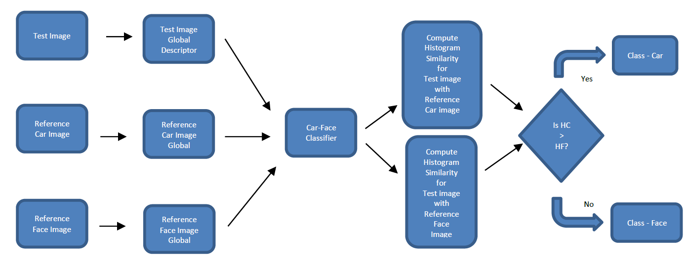
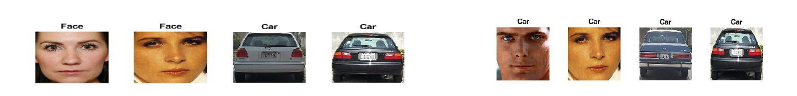

# Computer-Vision-Courseworks
I have uploaded some of the courseworks which I found very interesting to work with.

<b>LBP Classifier</b>

The classifier uses the histogram intersection similarity measure to compare two histograms. The classifier takes as input the LBP global descriptors for test image and two LBP global descriptors of two reference images for face and car. The global descriptors for each of these images are the concatenated histograms computed in the previous task. Then the classifier will compute the histogram similarity value of test image descriptor with reference car image descriptor and another similarity value of test image descriptor with reference face image descriptor. If the similarity value for test image with car is greater than that with face, the classifier will classify the test image as a car and vice-versa. Two face and car images from the dataset are chosen as reference images and the other four are chosen as test images. 

<b>Counting moving objects in video (Connected Components Algorithm)</b> 

Challenges faced during implementation -

a) Choosing a threshold value that will get rid of all noises but also keep every moving object pixel in the image. Noises themselves will get counted as objects if they are not removed.
b) Frames in the video where two moving objects conflict. Both of them will be interpreted as a single object.
c) Moving objects very far away are barely visible in a thresholded binary image. At one point they look like a couple of dots.

Steps taken to achieve task –

1)Background Subtraction – I subtracted the backgrounded generated in the previous task, from all the frames to eliminate the static noises in all frames

2)Frame Differencing – I calculate the difference frames for all frames using the function implemented in the question 5(a)

3)Dilation – I apply a morphological operation called dilation to expand the white pixels in order to connect the nearest white pixels that are disconnected in the binary images of the difference frames. I use two structuring element – a 3x1 horizontal element and a 3x1 vertical element of ones. I tried using both together to shape the expanded moving objects to be able to overcome the hurdles mentioned above.

4)Connected component – I implement the connected components algorithm in a function and use it on the dilated frames to count the number of objects. This algorithm scans through all the pixels and assigns labels to connected pixels in the same region.
The visual plot above shows the result of the procedure I described above. The results are not 100% accurate as the objects were not connected entirely in every frame. The dilation didn’t work perfectly for all frames. Other techniques for pre-processing the binary image before applying the algorithm may give better results.
